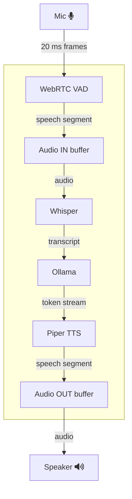

# local-voice
Locally running AI voice assistant for low-latency conversations, powered by OpenAI Whisper, Ollama, and Piper TTS.

## Overview 
An AI Voicebot based on a 3-stage (STT->LLM->TTS) pipeline. The architecture prioritizes low-latency, even for CPU-only inference.
*Zero-copy audio buffers*, *WebRTC-VAD endpointing*, *token-streaming LLM calls*, and *chunked TTS playback* combine under a single event loop with built-in back-pressure to drive sub-1s latency without specialized hardware.

## Design

